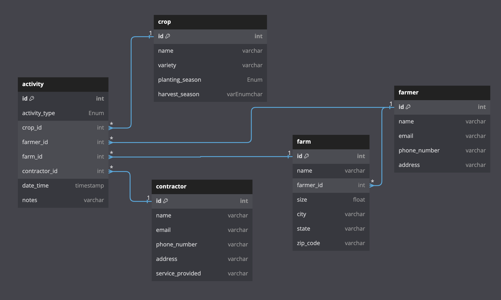

# Farmer Crop Activity Tracking System

## Introduction

During my time at FetchTV, I took pride in designing a cleanly architected system that can evolve over time. For this
purpose, I opted for an event-driven design, which offers several advantages for obvious and unlisted reasons. An
event-driven system comprises two key components:

- A mechanism to capture events
- A mechanism to process the events

One significant advantage of an event-driven system is the ability to capture data in the present and decide what to do
with it later. Additionally, if there is a need to recalculate data retroactively, we can reprocess the events at a
given point in time in the past. It has indeed happened in the past many times, also it serves a robust tool for
auditing purpose.

In our scenario, I noticed some ambiguities and decided to simplify the system by using an event tracking approach with
the following components:

## Farmer-Crop-Farm Relationship

The system revolves around a series of events involving these three entities, and I started with the following
assumptions:

- A farmer can have one or many farms.
- A farm can belong to only one farmer.
- A farmer can plant one crop in one field at a given time (subject to change later).

In the agricultural business, farmers engage in various activities such as, tilling, planting, harvesting, fertilizing,
and more

To capture all interactions between the three entities, I introduced the concept of an **Activity**, which serves as the
central component to record all actions involving farmers, fields, and crops. Activities are defined using an enum to
strictly identify activity types, such as tilling, planting, and harvesting. The activity table can be extended to
include other activities, such as hiring, selling items, equipment orders, and repairs.

For now, we will focus on the following main activities:

- Tilling
- Planting
- Harvesting
- Fertilizing
- Irrigation

### Activity Table Structure

The Activity Table consists of the following attributes:

- `Activity ID`: A unique identifier for each activity record.
- `Farm ID`: ID of the farm involved in the activity.
- `Crop ID`: ID of the crop used in the activity (can be null for activities without crops).
- `Activity Type`: Enum defining the type of activity (tilling, planting, harvesting, etc.).
- `Timestamp`: Timestamp of when the activity occurred.

Initially, our relationship looks like this: 

This design is crucial as it allows us to adapt to the changing nature of the business.

### Support for Outsourcing Contractors

In reality, farmers often hire contractors for activities like tilling, harvesting, planting, pest control, etc. Thus,
it makes sense to introduce another entity called **Contractor**. Now the table structure will look like this:



### Additional Fields for Different Activity Types

In our assignment, we need to store additional information specific to each activity type. For example, for tilling, we
may need to track the type of tilling (e.g., conventional tilling vs. reduced tilling) and the depth of tilling. It's
perfectly acceptable to add more columns to the table to accommodate such data. The sample activity table will look
something like this:

    +---------------+-----------+-----------+--------------+--------------+---------------------------------+
    | activity_id   | farmer_id | farm_id   | crop_id      | activity_type| tillage_type        | till_depth|
    +---------------+-----------+-----------+--------------+--------------+---------------------------------+
    | 1             | 101       | 201       | 301          | Tilling      | ConventionalTillage | 8.2       |
    | 2             | 101       | 202       | 302          | Planting     | -                   | -         |
    | 3             | 102       | 203       | 303          | Harvesting   | -                   | -         |
    | 4             | 103       | 204       | 304          | Tilling      | ReducedTillage      | 4.0       |
    | ...           | ...       | ...       | ...          | ...          | ...                 | ...       |
    +---------------+-----------+-----------+--------------+--------------+---------------------+-----------+

While SQL can handle more columns, performance can be optimized with proper indexing, and data integrity can be
maintained at the DB level using `CHECK` constraints and `Pydantic` at the application level.

As requirements change, it may be necessary to separate concerns and split the table into multiple ones to track
different columns for different activities. For instance, we may need different columns for activities like tilling,
harvesting, irrigation, fertilization, pest control, and weeding.

Imagine the times we need to track more moving parts.

- Irrigation:
    - irrigation method: (e.g., drip irrigation, sprinkler).
    - duration
    - equipment
    - supplier_id

- Fertilization:
    - fertilizer type: (e.g., organic, inorganic)
    - quantity used
    - brand

- Pest control:
    - pesticide type
    - brand
    - quantity used
    - target pest
    - application area

Instead of cramming all into one single table a robust and efficient solution would be to implement the single table
inheritance pattern. This means keeping the activity table slim and storing only the activity type, while each activity
type has its own table with a reference back to the activity table. This way, the activity table contains the
chronological truth of what activities happened, while the other tables contain the specific details of each activity.

With this approach, our updated structure would look like this


## More thoughts

### Do we need a state machine?

While brainstorming this, I felt heavily nervous and uncomfortable with randomly throwing activities like Tilling, Irrigating, and Harvesting without a structured approach.

Imagine a system that accepts an activity row for harvesting a crop that has never been planted in the first place. Furthermore, consider the system growing bigger and being used not only to capture past events but also to schedule future events. Booking a service to a contractor that is not needed could result in financial risk.

To avoid these issues and implement a more graceful solution, I suggest designing a state machine where the **states** between the entities (Farm, Farmer, Crop) and the **allowed transitions** are clearly defined.

It would be prudent to deploy the state machine even before events are added to the Activity table so that the truth will remain intact. By doing so, we can ensure a more organized and controlled system for managing farm-related activities.


### Thoughts on intercropping

During the initial design phase, we made a key assumption that a Farm can grow only one crop at a given time. This assumption allowed for some flexibility, as we didn't need to explicitly store the `crop_id` for certain activity types like irrigation or harvesting. Instead, we could implicitly calculate the `crop_id` based on the most recent planting event on a given Farm.

The logic to calculate the `crop_id` was presented as follows:

```python
# If the activity type is "harvesting" and crop_id is not provided, populate it based on the previous planting event

if activity.activity_type == ActivityType.harvesting and activity.crop_id is None:
     prev_planting_query = Activity.__table__.select().where(
        (Activity.field_id == activity.field_id) &
        (Activity.activity_type == ActivityType.planting) &
        (Activity.id < activity.id)  # Ensure the previous planting occurred before the current harvesting
     ).order_by(Activity.id.desc()).limit(1)
     
     prev_planting =  database.fetch_one(prev_planting_query)
     activity.crop_id = prev_planting.crop_id
```
 
intercropping introduces a new scenario that breaks the existing assumption. Intercropping involves growing multiple crops simultaneously on the same farm. To accommodate intercropping in the current design, we need to make some changes. The most important modification is to store the `crop_id` explicitly, instead of relying on it being calculated as shown in the above logic.

By storing the `crop_id`, the system can handle intercropping effectively. We may need to adjust other parts of the design and logic to fully support intercropping, but for now the system can support basic version of intercropping as is

### Coming back to the original question

The primary objective was to create a mechanism that facilitates a front-end form, allowing users to enter and save details of a 4-digit year along with tillage and crop information. To achieve this, all the details could be stored within the Activity table since they are fundamentally events. the idea is to design a robust event store and expose an API, enabling the front-end to interface with it

Additionally, it is often encouraged to extend the state machine to the database level and on the front-end side. This helps ensure data integrity and improves the user experience. 

In our specific question, the objective is to ask the user to enter a 4-digit year while also incorporating the season based tilling details also the crop details. I would strongly recommend to store the approximate year-month in the timestamp format. This is still okay even though the user form can ask YYYY format in the storage side we can still dump those details in the Activity table. Because they are all just *events*

## Tasks completed. 
- Exposed APIs for the models Farmer, Farm, Activity, Crops
- Implemented a generic CRUD component and used the same to generate CRUD endpoints for all the models to avoid code duplication Ref. [`routers/generic_router.py`](routers/generic_router.py)
- Added sample dada under `fixures.py` to bring the project up faster and explore via swagger.
- Added `pydantic` validator for Tilling related constraints, [Try here](http://0.0.0.0:8000/docs#/Activities/create_item_activities__post)
- General unittests and detailed tests for Activity model